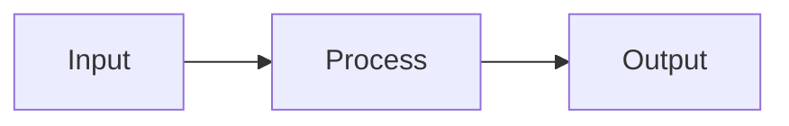

# Slidev Presentation Skill

Generate professional presentations using [Slidev](https://sli.dev), a markdown-based presentation tool for developers.

---

## WORKFLOW: Follow These Steps In Order

**Complete these steps for EVERY presentation. Do not skip steps.**

### Step 1: Gather User Preferences (MANDATORY - DO NOT SKIP)

**CRITICAL: Use `AskUserQuestion` to ask these questions BEFORE creating any files.**

Present these two questions to the user:

**Question 1: Theme preference?**
- Default: `dracula` (dark purple/cyan/green, ideal for tech)
- Show the theme options table below for alternatives

**Question 2: Custom AI-generated images?**
- Hero image for title slide?
- Closing slide image?
- (Requires `nano-banana` MCP - check if available)

**Theme Options to Present:**

| Theme | Package | Style | Best For |
|-------|---------|-------|----------|
| `dracula` | `slidev-theme-dracula` | Dark purple/cyan/green | Tech content (DEFAULT) |
| `default` | `@slidev/theme-default` | Clean, minimal | General purpose |
| `seriph` | `@slidev/theme-seriph` | Elegant serif | Business, professional |
| `apple-basic` | `@slidev/theme-apple-basic` | Apple Keynote style | Product launches |
| `academic` | `slidev-theme-academic` | Academic style | Research, education |
| `purplin` | `slidev-theme-purplin` | Purple professional | Corporate tech |

### Step 2: Create Project Structure

Create the project folder with required structure:

```
presentation-name/
├── slides.md        # Presentation content (Step 5)
├── package.json     # Dependencies (Step 3)
└── public/          # Images (Step 4, if generating)
```

### Step 3: Create package.json (REQUIRED)

**Without this file, `npm run dev` fails. Always create it first.**

```json
{
  "name": "presentation-name",
  "private": true,
  "scripts": {
    "dev": "slidev",
    "build": "slidev build",
    "export": "slidev export",
    "export-png": "slidev export --format png",
    "export-pptx": "slidev export --format pptx"
  },
  "dependencies": {
    "@slidev/cli": "^0.50.0",
    "THEME_PACKAGE": "latest"
  }
}
```

Replace `THEME_PACKAGE` with the chosen theme package from Step 1.

### Step 4: Generate Custom Images (If Requested)

**Skip this step if user declined custom images in Step 1.**

Check if `nano-banana` MCP is available. If available:

1. Create `public/` folder
2. Generate images using `generate_image_to_file`:
   - `aspect_ratio: "16:9"` (required for slides)
   - `style_preset: "tech"` or `"corporate"` or `"minimal"`
   - Save to `public/hero.png`, `public/closing.png`

3. Example prompts:
   - Title: `"Abstract visualization of [TOPIC], dark purple and cyan gradients, tech aesthetic, no text, no letters"`
   - Closing: `"Glowing path toward bright horizon, hopeful mood, blue and gold tones, no text, no letters"`

**Fallback if nano-banana unavailable:**
- Use `background: https://cover.sli.dev` for abstract gradients
- Use solid theme colors
- Skip background images entirely (Slidev looks good without them)

### Step 5: Create slides.md

Create the presentation content using the syntax in the Quick Reference section below.

**Frontmatter (first slide):**
```yaml
---
theme: CHOSEN_THEME
background: /hero.png
title: Presentation Title
class: text-center
transition: slide-left
mdc: true
layout: cover
---
```

**IMPORTANT:** Use `layout: cover` when using a `background:` image. Without it, the background may not display properly depending on the theme.

If no custom images: use `background: https://cover.sli.dev`

### Step 6: Generate Preview Thumbnails

**After creating the presentation, generate thumbnails for visual verification:**

```bash
cd presentation-name
npm install
npx slidev export --format png --output ./thumbnails
```

This creates PNG images for each slide:
- `thumbnails/001.png` - Slide 1
- `thumbnails/002.png` - Slide 2
- etc.

**Show the user these thumbnails** to catch issues before presenting:
- Mermaid diagram overflow
- Missing or broken images
- Layout problems
- Text overflow

### Step 7: Run and Verify

Start the presentation and verify everything works:

```bash
npm run dev
# Opens http://localhost:3030
```

**Verification checklist:**
- [ ] All slides render correctly
- [ ] Mermaid diagrams fit without overflow
- [ ] Images display properly
- [ ] Animations work (click through all v-clicks)
- [ ] Theme applied correctly

---

## Quick Reference

### Slide Separator

Use `---` to separate slides. Each slide can have per-slide frontmatter:

```markdown
---
layout: two-cols
transition: fade-out
---

# Slide content here
```

### Common Layouts

| Layout | Use Case |
|--------|----------|
| `default` | Standard slide |
| `cover` | Title slides with background image |
| `center` | Centered content |
| `two-cols` | Two columns (use `::right::` separator) |
| `image-right` | Content left, image right |
| `image` | Full background image |

**For detailed layout examples:** See `references/layouts.md`

### Progressive Reveal (v-clicks)

```markdown
<v-clicks>

- First item (click 1)
- Second item (click 2)
- Third item (click 3)

</v-clicks>
```

**For more animation options:** See `references/animations.md`

### Code Blocks with Highlighting

````markdown
```python {all|2|3-4|all}
@dataclass
class Memory:
    content: str
    confidence: float
```
````

Syntax: `{all|2|3-4}` = progressive highlighting (all → line 2 → lines 3-4)

**For detailed code block syntax:** See `references/code-blocks.md`

### Mermaid Diagrams

**CRITICAL: Slides are 960x540 pixels. Diagrams overflow easily!**

Golden rules:
1. Use `LR` (left-right) for pipelines on full-width slides
2. Use `TB` (top-bottom) in `two-cols` layout (columns are narrow)
3. Always use scale: `{scale: 0.6}` for 5+ nodes
4. Keep labels short (2-3 words max)
5. Max 4 nodes vertically, 6-7 horizontally
6. **NEVER use subgraphs in two-cols** - they overflow

````markdown

````

**For comprehensive Mermaid guide:** See `references/mermaid.md`

### Styling with UnoCSS

Common classes:
- Spacing: `mt-4`, `mb-8`, `p-4`, `gap-8`
- Text: `text-center`, `text-xl`, `font-bold`
- Colors: `text-teal-500`, `bg-gray-50`
- Layout: `grid grid-cols-2`, `flex items-center`

**For full styling reference:** See `references/styling.md`

### Images

Local images go in `public/` folder:
```markdown
---
layout: cover
background: /hero.png
---
```

Or inline:
```html

```

**For image sources and handling:** See `references/images.md`

### Transitions

```yaml
---
transition: slide-left
---
```

Options: `slide-left`, `slide-right`, `slide-up`, `slide-down`, `fade`, `fade-out`, `zoom`

### Speaker Notes

```markdown
# Slide Title

Content here

<!--
Speaker notes go here.
Visible in presenter mode (press 'p')
-->
```

---

## Keyboard Shortcuts (Dev Mode)

| Key | Action |
|-----|--------|
| `Space` / `→` | Next slide/click |
| `←` | Previous |
| `o` | Slide overview |
| `p` | Presenter mode |
| `d` | Toggle dark mode |

---

## Export Commands

```bash
npm run dev          # Live preview at localhost:3030
npm run export       # Export to PDF
npm run export-png   # Export to PNG images
npm run export-pptx  # Export to PowerPoint
```

---

## Reference Files

For detailed documentation on specific topics:

| File | Contents |
|------|----------|
| `references/layouts.md` | All layout options with examples |
| `references/mermaid.md` | Mermaid diagram guidelines and sizing |
| `references/animations.md` | v-click and animation syntax |
| `references/code-blocks.md` | Code highlighting options |
| `references/styling.md` | UnoCSS classes reference |
| `references/images.md` | Image sources and handling |
