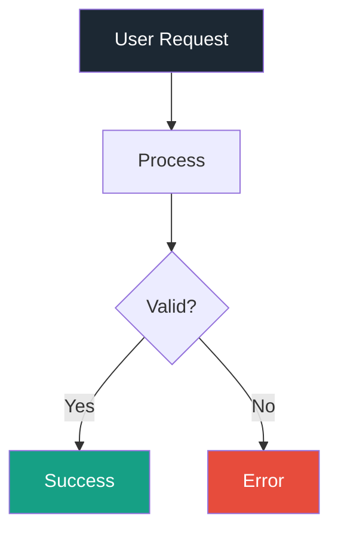

# Example Presentation

Demonstrating Slidev features

<div class="pt-12">
  <span class="px-4 py-2 rounded-full text-sm bg-white/10">
    Generated with Claude + Slidev Skill
  </span>
</div>

---
transition: fade-out
---

# Progressive Reveal

Use `v-clicks` to reveal items one at a time:

<v-clicks>

- First point appears
- Second point appears
- Third point appears
- Final point appears

</v-clicks>

<div v-click class="mt-8 p-4 bg-teal-500/20 rounded-lg border border-teal-500/50">
  This box appears after all bullets!
</div>

---
layout: two-cols
layoutClass: gap-8
---

# Two Column Layout

Left side content goes here.

<div class="space-y-4">

<div v-click class="p-3 border-l-4 border-teal-500 bg-gray-50 rounded">
  <span class="text-teal-500 font-bold">1.</span> <b>Feature One</b><br>
  <span class="text-gray-500 text-sm">Description here</span>
</div>

<div v-click class="p-3 border-l-4 border-teal-500 bg-gray-50 rounded">
  <span class="text-teal-500 font-bold">2.</span> <b>Feature Two</b><br>
  <span class="text-gray-500 text-sm">Another description</span>
</div>

</div>

::right::

### Right Column

This content appears on the right side of the slide.

Perfect for:
- Code examples
- Diagrams
- Images

---

# Mermaid Diagrams



---

# Code with Line Highlighting

Click through to highlight different lines:

```python {all|1-2|4-5|7-8|all}
# Step 1: Import
from dataclasses import dataclass

# Step 2: Define
@dataclass
class User:
    # Step 3: Fields
    name: str
    email: str
```

---
layout: center
class: text-center
---

# Thank You!

<div class="mt-8 text-gray-400">
  Created with Slidev + Claude
</div>

<!--
Speaker notes go here.
These are only visible in presenter mode (press 'p').
-->
